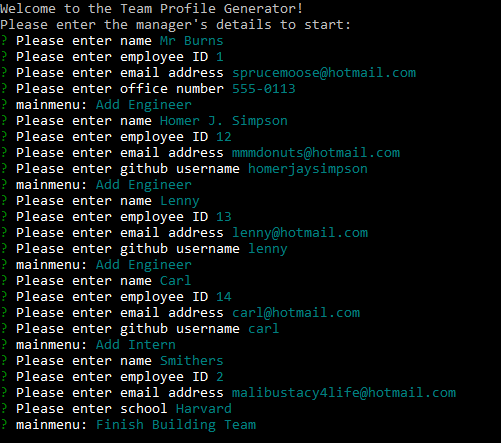

# Team-Profile-Generator
A node.js based command line application to generate employee profiles. This takes input from a user and generates an HTML file based on responses based on inquirer.

## Installation

Clone the project or download a zip using the GitHub links above. 

Install node.js if it is not already on your machine

Run npm install to install dependencies.

## Usage

Run 'node index.js' to start the generator.
A series of prompts will ask you for details of your team. Fill in the details.
When you have finished, your team profile file (team.html) will be generated in the /output folder.

https://github.com/webtam81/Team-Profile-Generator/assets/140503551/e9c15e02-31f3-4418-917f-b6dfc1bf6b90

## License

This project is covered under the **MIT** license.

